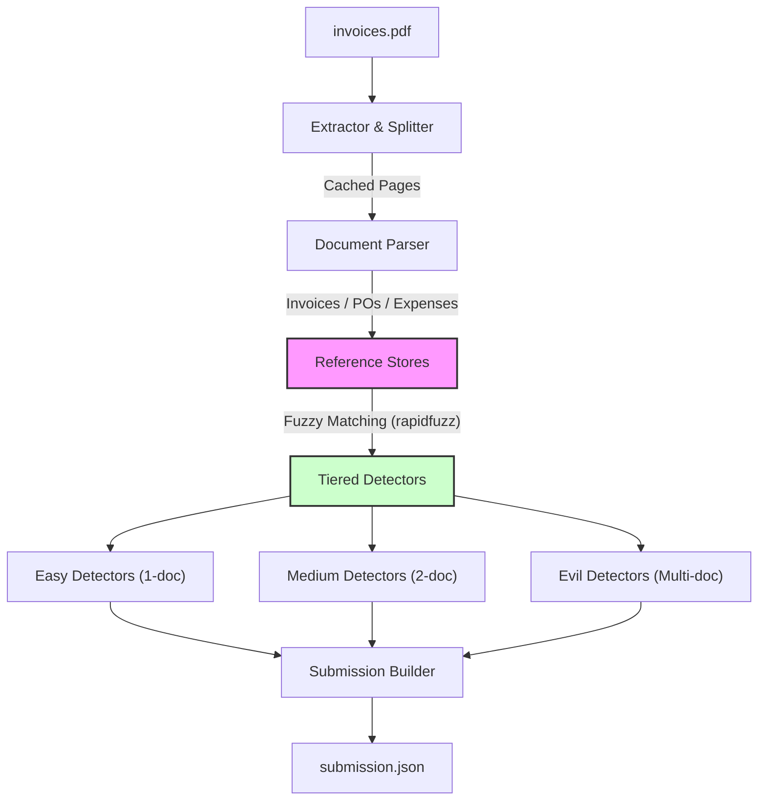

# 🏴 Financial Gauntlet — Fraud Detection Pipeline
**Team:** `baby_sharks_v99` | **HyperAPI Hackathon 2026** | Mar 14, 2026 · JBR Techpark, Whitefield

---

### 🥈 Final Leaderboard Result
| Metric | Value |
| :--- | :--- |
| **Rank** | 🥈 #2 of 54 teams |
| **Score** | 648.68 / 920 max |
| **Accuracy** | 70.5% |
| **Needles detected** | 176 / 200 |
| **Easy** | 22 / 40 (17.8 pts) |
| **Medium** | 54 / 60 (133.5 pts) |
| **Evil** | 100 / 100 (534.88 pts) ✅ |
| **Penalty** | −37.5 |
| **Submitted** | 14 Mar 2026, 05:50 PM |

> [!NOTE]
> **Evil category: perfect score (100/100).** Our pattern-based detection approach successfully identified all Evil category needles with zero misses. Minor penalties in other tiers were due to strict confidence thresholds used to prioritize precision.

---

## 🛠️ How It Works

Our pipeline processes a 1000-page financial bundle (`invoices.pdf`) using a tiered architecture that combines deterministic parsing with fuzzy cross-referencing.



### The 5 Phases:
1.  **PDF Extraction**: High-fidelity text extraction via `pdfplumber`, with automated page caching to `data/extracted_pages.pkl`.
2.  **Document Parsing**: Context-aware segmentation into document types (Invoices, POs, Statements) with field extraction.
3.  **Reference Stores**: Construction of in-memory searchable indexes (Vendor Registry, PO Store, Bank Chain) for rapid cross-referencing.
4.  **Needle Detection**: Execution of 20+ specialized detectors across three complexity tiers.
5.  **Assembly**: Deduplication and formatting of findings into the final leaderboard schema.

---

## 🚀 Quickstart

### 1. Install dependencies
```bash
pip install -r requirements.txt
```

### 2. Run the full pipeline
```bash
python main.py --pdf invoices.pdf --team-id baby_sharks_v99
```

### Command Options
| Flag | Purpose |
| :--- | :--- |
| `--use-llm` | Enable OpenAI-backed parsing for complex layouts |
| `--force-extract` | Ignore cache and re-run PDF OCR/Extraction |
| `--max-pages <N>` | Process only the first N pages for testing |
| `--save-intermediate` | Export parsed document summaries to `data/` |

---

## 📁 File Overview

| File / Directory | Purpose |
| :--- | :--- |
| `main.py` | Pipeline orchestrator and CLI entry point |
| `src/extractor.py` | PDF processing, OCR coordination, and page-to-document splitting |
| `src/parser.py` | Regex-based deterministic field extraction from document text |
| `src/reference_store.py` | In-memory data structures for cross-document verification and indexing |
| `src/detectors/` | The "brain" of the project: `easy.py`, `medium.py`, and `evil.py` |
| `src/vendor_master.py` | Ground-truth database of 35 registered vendors and GSTINs |
| `src/llm_parser.py` | Optional LLM enhancement layer for low-confidence EXTRACTION |
| `src/utils.py` | Shared utilities for date normalization and amount parsing |

---

## 🧶 How We Detected (Methodology)

### 😈 Evil (7 pts each)
Detectors analyze patterns across 3–12+ documents simultaneously.
| Category | Logic |
| :--- | :--- |
| **quantity_accumulation** | Aggregated `sum(qty)` across all invoices linked to a PO exceeds PO limit. |
| **price_escalation** | Detects if *all* invoices for a PO charge higher rates than contracted. |
| **balance_drift** | Validates the continuity of bank balances between consecutive statements. |
| **circular_reference** | DFS-based graph traversal to find cycles in Credit/Debit notes without a base. |
| **triple_expense_claim** | Multi-report indexing to catch identical expense entries in 3+ reports. |
| **employee_id_collision** | Cross-indexes reports to find multiple names sharing a single employee ID. |
| **fake_vendor** | Cross-checks GSTINs and names against the Master using fuzzy matching. |

### ⚖️ Medium (3 pts each)
Focuses on inconsistency between two distinct document types.
| Category | Logic |
| :--- | :--- |
| **po_invoice_mismatch** | Direct field comparison between an Invoice and its referenced PO. |
| **vendor_name_typo** | `rapidfuzz` similarity check (>70%) against expected Vendor Master names. |
| **double_payment** | Matches normalized payment references and amounts across bank months. |
| **gstin_state_mismatch** | Validates the state code prefix of a GSTIN against the address on the invoice. |

### 🟢 Easy (1 pt each)
Mathematical and single-document validity checks.
| Category | Logic |
| :--- | :--- |
| **arithmetic_error** | Validates `qty * rate`, `sum(lines)`, and `tax + subtotal` calculations. |
| **billing_typo** | Detects minute-to-decimal conversion errors (e.g., .30 hrs vs .50 hrs). |
| **invalid_date** | Regex-based detection of impossible dates (e.g., Feb 30). |

---

## 🧠 Design Decisions

- **Reference-Store Architecture**: Instead of iterating over raw text for every check, we build structured "Stores" once. This makes the detection phase extremely fast (<1s).
- **Fuzzy Item Matching**: We use `rapidfuzz.token_sort_ratio` to link invoice items to PO items, handling variations in descriptions (e.g., "Widget A" vs "Widget - Type A").
- **Structural Signals**: For `date_cascade`, we only fire if *all* invoices for a PO are "early," distinguishing a deliberate needle from common business delays.
- **Idempotency & Caching**: The pipeline is designed to be re-run safely. Cached page text saves minutes of processing time during iterative testing.
- **Strict GST Validation**: We use a custom HSN-to-Tax mapping to identify vendors charging the wrong GST slab despite the math being "correct."
